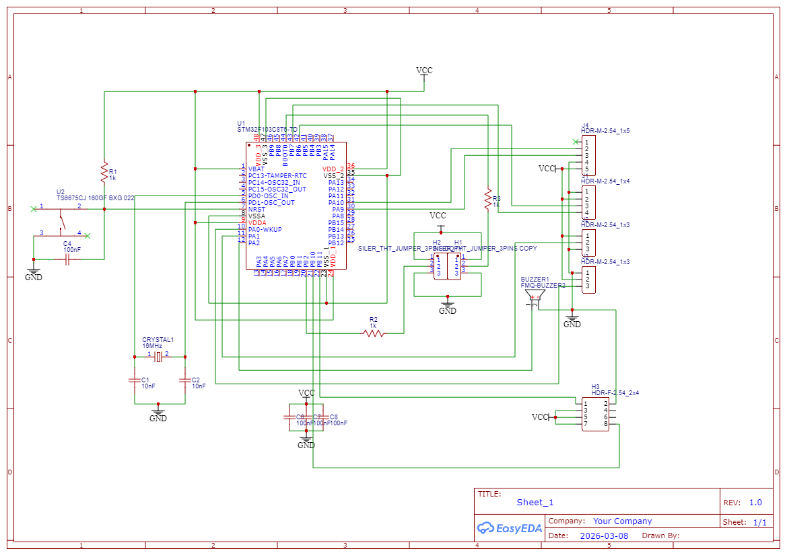
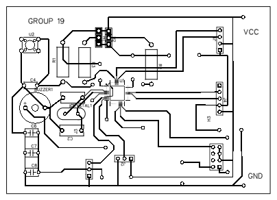

<p align="center">
  
</p>

<h1 align="center">NimbusAI</h1>

<p align="center">
  <strong>Rainfall Detection and Short-Term Prediction using GNSS and TinyML</strong><br>
  Electronics and Computer Engineering, Hardware-Software Integrated Embedded System
</p>

---


<br>


## 📌 Project Overview

This project focuses on the design and development of an **intelligent embedded system** for **rainfall detection and short-term rainfall prediction** using **GNSS signal attenuation**, **environmental sensors**, and **Tiny Machine Learning (TinyML)**.

Unlike traditional rainfall monitoring systems that rely on expensive radar or large-scale meteorological infrastructure, this system leverages **Signal-to-Noise Ratio (SNR) variations of GNSS signals** as an indirect environmental sensing mechanism. These GNSS-derived features are combined with **humidity** and **rainfall intensity sensor data**, and processed locally on an **STM32 microcontroller** using a lightweight TinyML model.

The system performs **real-time inference at the edge**, without requiring cloud connectivity, making it suitable for **low-cost, low-power, and scalable deployment**.

---
<br>


## 🎯 Project Objectives

- Detect rainfall events in real time using GNSS signal attenuation
- Predict short-term rainfall conditions using TinyML
- Integrate multiple sensors for improved reliability (sensor fusion)
- Implement the complete system on an **STM32 microcontroller**
- Provide a user interface to visualize system outputs
- Comply fully with **EC6020 Mini Project guidelines**

---
<br>


## 🧠 Key Technical Concepts

- GNSS Signal-to-Noise Ratio (C/N0) analysis
- Embedded systems design using STM32
- Sensor interfacing using UART and I2C
- Feature extraction from time-series GNSS data
- TinyML deployment on resource-constrained hardware
- Edge-based machine learning inference

---
<br>


## 🧩 System Architecture (High-Level)

**Inputs:**
- GNSS SNR values from GNSS receiver
- Humidity sensor readings
- Rainfall intensity sensor output

**Processing:**
- Feature extraction (mean SNR, SNR variation, rainfall intensity, humidity level)
- TinyML inference on STM32

**Outputs:**
- Rainfall detection status
- Short-term rainfall prediction
- Humidity level
- Data visualization through UI

---
<br>

## 🎓 Theoretical Background: Rain Intensity vs SNR

### 1. Specific Attenuation
γ = a R^b

### 2. Total Attenuation
A = γ × Lp

### 3. SNR (Linear Form)
SNR = Pr / N

### 4. SNR (dB Form)
SNR(dB) = Pr(dB) − N(dB)

### 5. Received Power
Pr = Pt − A

### 6. Combined Model (Rain → SNR)
SNR = Pt − (a R^b Lp) − N

### 7. Extended Model (Temperature & Humidity)
SNR = Pt − (a R^b Lp + αT + βH) − N

### 📌 Variables

γ  = specific attenuation (dB/km)  
R  = rain intensity (mm/h)  
a, b = constants (frequency & polarization dependent)  
A  = total attenuation (dB)  
Lp = path length (km)  
Pt = transmitted power (dB)  
Pr = received power (dB)  
N  = noise power (dB)  
T  = temperature  
H  = humidity  
α, β = environmental coefficients  

---
<br>


## 📂 Repository Structure

The repository is organized to clearly separate **documentation**, **hardware design**, **firmware**, **machine learning**, and **user interface** components.

```text
Gnss-rainfall-detection-tinyML/
│
├── docs/
│   ├── pdfs/
│   ├── imgs/
│   └── presentations/
│
├── hardware/
│   └──Gerber_Embeded-PCB_PCB_Embeded-PCB/
│
├── firmware/
│   ├── Arduino/
│   ├── Tests/
│   └── stm32_code/
│
├── ml/
│   ├── dataset/
│   ├── training_scripts/
│   ├── testing/
│   └── model/
│ 
├── app/
│   └── NimbusAI/
│ 
├── README.md
└── .gitignore
```

---
<br>


## 🛠 Hardware Components

- STM32 microcontroller
- GNSS receiver module
- Humidity sensor
- Rainfall intensity sensor
- Power regulation and support circuitry

---
<br>


## 🔌 Circuit Design

Complete circuit artifacts are available in the hardware folder:

- Schematic:
<p align="center">
  
</p>

- PCB layout: 
<p align="center">
  
</p>

---
<br>


## 💻 Software and Tools

- **Embedded Development:** STM32CubeIDE, STM32CubeProgrammer, Embedded C/C++
- **Machine Learning:** Python, NumPy, Pandas, Scikit-learn
- **TinyML:** TensorFlow Lite for Microcontrollers
- **Mobile Application:** Flutter (NimbusAI)
- **Version Control:** Git and GitHub
- **Testing and Debugging:** Serial monitors, logic analyzer, multimeter

---
<br>


## 🔬 Machine Learning Approach

- GNSS and sensor data are collected and logged
- Features are extracted from time-series data
- A lightweight ML model is trained offline
- The trained model is converted to TinyML format
- The model is deployed on STM32 for real-time inference

---
<br>


## 🧪 Testing and Validation

- System tested under dry and rainy conditions
- Model predictions compared with actual rainfall observations
- Performance evaluated based on accuracy and response time

---
<br>


## 📦 Deliverables

- Fully functional embedded prototype
- TinyML model deployed on STM32
- GitHub repository with complete documentation
- MID and END evaluation presentations

---
<br>


## 📚 References

1. ITU-R P.838-3: Specific attenuation model for rain for use in prediction methods
2. ITU-R P.618: Propagation data and prediction methods required for Earth-space systems
3. TensorFlow Lite for Microcontrollers documentation: https://www.tensorflow.org/lite/microcontrollers
4. TinyML Foundation resources: https://www.tinyml.org
5. NumPy documentation: https://numpy.org/doc/
6. pandas documentation: https://pandas.pydata.org/docs/
7. scikit-learn documentation: https://scikit-learn.org/stable/
8. Alozie et al., “Rain Signal Attenuation Modeling,” Sustainability, 2022. https://doi.org/10.3390/su141811744
9. ITU-R P.838-3, Rain Attenuation Model. https://www.itu.int/rec/R-REC-P.838
10. ITU-R P.530-17, Propagation Prediction Methods. https://www.itu.int/rec/R-REC-P.530
12. Appuhamilage et al., Impact of temperature and humidity on SINR in LTE networks, 2025:https://doi.org/10.59324/ejaset.2025.3(2).09
13. Hao and Lu, Variation of relative humidity and air temperature, 2022:https://doi.org/10.3390/atmos13081171
14. Romps, Analytical model for tropical relative humidity, 2014:https://doi.org/10.1175/JCLI-D-14-00255.1
15. Agbo and Edet, Meteorological analysis of climatic parameters, 2021: https://doi.org/10.1007/s00704-022-04226-x

---
<br>


## 👥 Team and Mentors

This project is developed by a **5-member team** as part of the **EC6020 Mini Project**.
Team roles (hardware design, firmware development, ML modeling, UI development, documentation) are clearly defined in the project documentation.

| Member | Role | Name |
|---|---|---|
| Member 1 | Team Lead |Kumari H.A.R. |
| Member 2 | Firmware Engineer |Senarath S.M.D.P. |
| Member 3 | ML Engineer |Patabadige M.P.H.R.|
| Member 4 | Hardware Engineer |Galahitiyawa G.R.M.M. |
| Member 5 | App and Documentation Engineer |Senarathna S.A.D.H.D. |

| Name | Role |
|---|---|
| Mentor 1 | Academic Supervisor |
| Mentor 2 | Technical Mentor (if applicable) |

---
<br>


## ⚠️ Notes

- This repository is intended for **academic and educational purposes only**
- All work complies with EC6020 project rules and originality requirements

---
<br>


## 📄 License

This project is developed as part of an academic course and is not intended for commercial use without permission.

---
<br>


## ✅ Status

Work in progress - ongoing development and testing.

---

